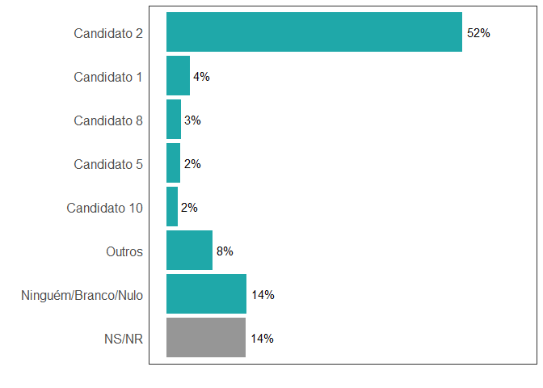

Avaliação técnica — Quaest, Data Scientist Jr.
================
Priscila Gregorio Bernardo<br>
Maio 2021

### Descrição

Este relatório contem as atividades do processo seletivo para a vaga de *Data Scientist Jr* da empresa *Quaest*. Abaixo descrevo a estrutura do repositório:

-   **dados**: diretório que armazena os dados utilizados nas atividades
-   **R**: diretório dedicado à armazenar arquivos do tipo .R com funções utilizadas nas atividades.
    -   `funcoes.R`: função utilizada na tarefa 1;
    -   `script.R`: comandos `R` para realização das atividades de forma sequencial.
-   **relatorio-files**: diretório criado automaticamente para armazenar as figuras usadas no relatório.

O arquivo **relatorio.Rmd** é do tipo [rmarkdown](https://rmarkdown.rstudio.com/) que pode ser compilado para geração do relatório **relatorio.md**. Este formato é amplamente utilizado para reproduzir pesquisas e combinar códigos e textos em um mesmo arquivo.

### Pacotes utilizados

Abaixo foram carregados os pacotes utilizados para a leitura da base de dados, análises e construção dos gráficos.

``` r
library(readxl)
library(dplyr)
library(tidyr)
library(forcats)
library(ggplot2)
```

### Base de dados

Leitura da base de dados:

``` r
baseq01 <- read_xlsx("dados/bd_surveyquaest.xlsx")
```

### Recodificação das variáveis

Para uma melhor análise dos dados, algumas variáveis foram agrupadas em categorias consideradas relevantes para interpretação e apresentação dos resultados. A variável intenção de voto (`voto1`) foi recodificada agrupando os candidatos com intenção de voto menor que 2% (`voto1_cat`). A variável idade consideramos três categorias: Jovem, Adulto e Maduro, como segue abaixo.

-   Idade recodificada (`idadef`):
    -   se `idade` menor que 30, então recebe *"Jovem"*
    -   se `idade` maior que 29 e menor que 60, então recebe *"Adulto"*
    -   se `idade` maior que 60, então recebe *"Maduro"*
-   renda
    -   se `rendaf` é menor que 5 SM, então recebe *"Até 5 SM"*
    -   se `rendaf` é maior que 5 SM e menor que 10 SM, então recebe *"Mais de 5SM até 10 SM"*
    -   se `rendaf` é maior que 10 SM, então recebe *"Mais de 10 SM"*
-   escolaridade
    -   se `esc` é igual a ensino fundamental completo ou ensino fundamental incompleto, então recebe *"Ensino Fund."*
    -   se `esc` é igual a ensino médio completo ou ensino médio incompleto, então recebe *"Ensino médio"*
    -   se `esc` é igual a ensino superior completo ou ensino superior incompleto, então recebe *"Ensino Sup."*
    -   se `esc` é igual a sem instrução e menos de 1 ano de estudo, então recebe *"Sem instrução e menos de 1 ano de estudo."*
-   avaliacao do governo
    -   se `aval_gov` é igual a boa ou ótima, então recebe *"Positiva"*
    -   se `aval_gov` é igual a regular negativa ou regular positiva, então recebe *"Regular"*
    -   se `aval_gov` é igual a péssima ou ruim, então recebe *"Negativa"*

``` r
baseq01 <- baseq01 %>%
  mutate(voto1_cat = case_when(voto1 == "Candidato 2" ~ "Candidato 2",
                               voto1 == "Candidato 1" ~ "Candidato 1",
                               voto1 == "Candidato 8" ~ "Candidato 8",
                               voto1 == "Candidato 5" ~ "Candidato 5",
                               voto1 == "Candidato 10" ~ "Candidato 10",
                               voto1 == "Ninguém/Branco/Nulo" ~ "Ninguém/Branco/Nulo",
                               voto1 == "NS/NR" ~ "NS/NR",
                               T ~ "Outros"),
         idadef = case_when(idade < 30 ~ "Jovem",
                            idade > 29 & idade < 60 ~ "Adulto",
                            T ~ "Maduro"),
         rendafa = case_when(rendaf == "Até R$ 1.045,00 (até 1 SM)" | rendaf == "De R$ 1.046,00 a R$ 2.090,00 (+ de 1SM até 2 SM)" | rendaf == "De R$ 2.091,00 a R$ 3.135,00 (+ de 2SM até 3 SM)" | rendaf == "De R$ 3.136,00 a R$ 5.225,00 (+ de 3SM até 5 SM)" ~ "Até 5 SM",
                             rendaf == "De R$ 5.226,00 a R$ 10.450,00 (+ de 5SM até 10 SM)" ~ "Mais de 5SM até 10 SM",
                             T ~ "Mais de 10 SM"),
         escr = case_when(esc == "Ensino fundamental completo" | esc == "Ensino fundamental incompleto" ~ "Ensino Fund.",
                          esc == "Ensino médio completo" | esc == "Ensino médio incompleto" ~ "Ensino Medio",
                          esc == "Ensino superior completo" | esc == "Ensino superior incompleto" ~ "Ensino Sup.",
                          T ~ "Sem instrução e menos de 1 ano de estudo"),
         aval_gov_rec = case_when(aval_gov == "Boa" | aval_gov == "Ótima" ~ "Positiva",
                                  aval_gov == "Regular negativa" | aval_gov == "Regular positiva" ~ "Regular",
                                  aval_gov == "Péssima" | aval_gov == "Ruim" ~ "Negativa",
                                  T ~ "NS/NR"),
         aval_gov_rec = fct_relevel(aval_gov_rec, c("Positiva", "Regular", "Negativa", "NS/NR")),
         idadef = fct_relevel(idadef, c("Jovem", "Adulto", "Maduro")),
         rendafa = fct_relevel(rendafa, c("Até 5 SM", "Mais de 5SM até 10 SM", "Mais de 10 SM")),
         escr = fct_relevel(escr, c("Ensino Fund.", "Ensino Medio", "Ensino Sup.")),
         voto1_cat = fct_relevel(fct_infreq(voto1_cat), c("Outros", "Ninguém/Branco/Nulo", "NS/NR"), after = Inf)
         
  )
```

## QUESTÃO 1

**Crie uma função em alguma linguagem de programação, preferencialmente em R ou Python, que automatize a construção de tabelas de contingência. O objetivo é identificar se há uma diferença sociodemográfica na intenção de voto. Em outras palavras, por ex.: As mulheres e os homens estão votando no mesmo candidato?**

A função `tabela_contig` para criar as tabelas de contigência está definida e documentada no arquivo `R/funcoes.R`. Após carregar a função no ambiente de trabalho através da função `source` basta aplicá-la aos dados. Os parâmetros da função `tabela_contig` são:

-   dados: base de dados em formato data.frame.
-   var\_linha: nome da variável que aparecerá nas linhas da tabela de contigência.
-   var\_coluna: nome da variável que aparecerá nas colunas da tabela de contingência.

Para exemplificar a função algumas tabelas foram contruídas para identificar se há diferença sociodemográfica na intenção de voto. As variáveis sociodemográficas presentes na base de dados são: sexo, idade, escolaridade e renda familiar.

###### Tabela 1 - Cruzamento de intenção de voto por sexo

``` r
source("R/funcoes.R")
tabela_contig(dados = baseq01, sexo, voto1_cat) %>%
  knitr::kable()
```

| voto1\_cat          |  perc\_Feminino|  perc\_Masculino|  freq\_Feminino|  freq\_Masculino|
|:--------------------|---------------:|----------------:|---------------:|----------------:|
| Candidato 2         |       54.128440|        50.109890|             295|              228|
| Candidato 1         |        2.018349|         6.813187|              11|               31|
| Candidato 8         |        2.568807|         2.637363|              14|               12|
| Candidato 5         |        2.568807|         2.417582|              14|               11|
| Candidato 10        |        2.568807|         1.318681|              14|                6|
| Outros              |        7.706422|         8.791209|              42|               40|
| Ninguém/Branco/Nulo |       13.211009|        15.384615|              72|               70|
| NS/NR               |       15.229358|        12.527473|              83|               57|

Na Tabela 1, podemos ver que grande parte dos homens e mulheres votam no mesmo candidato, o candidato 2. O segundo candidato que seria mais votado pelos homens é o candidato 1. O percentual de Ninguém/Branco/Nulo e NS/NR também são parecidos em ambos os sexos.

###### Tabela 2 - Cruzamento de intenção de voto por faixa etária

``` r
source("R/funcoes.R")
tabela_contig(dados = baseq01, idadef, voto1_cat) %>%
  knitr::kable()
```

<table style="width:100%;">
<colgroup>
<col width="21%" />
<col width="12%" />
<col width="13%" />
<col width="13%" />
<col width="12%" />
<col width="13%" />
<col width="13%" />
</colgroup>
<thead>
<tr class="header">
<th align="left">voto1_cat</th>
<th align="right">perc_Jovem</th>
<th align="right">perc_Adulto</th>
<th align="right">perc_Maduro</th>
<th align="right">freq_Jovem</th>
<th align="right">freq_Adulto</th>
<th align="right">freq_Maduro</th>
</tr>
</thead>
<tbody>
<tr class="odd">
<td align="left">Candidato 2</td>
<td align="right">49.781659</td>
<td align="right">51.197053</td>
<td align="right">57.456140</td>
<td align="right">114</td>
<td align="right">278</td>
<td align="right">131</td>
</tr>
<tr class="even">
<td align="left">Candidato 1</td>
<td align="right">1.310044</td>
<td align="right">4.972376</td>
<td align="right">5.263158</td>
<td align="right">3</td>
<td align="right">27</td>
<td align="right">12</td>
</tr>
<tr class="odd">
<td align="left">Candidato 8</td>
<td align="right">3.493450</td>
<td align="right">2.762431</td>
<td align="right">1.315789</td>
<td align="right">8</td>
<td align="right">15</td>
<td align="right">3</td>
</tr>
<tr class="even">
<td align="left">Candidato 5</td>
<td align="right">4.803493</td>
<td align="right">2.578269</td>
<td align="right">NA</td>
<td align="right">11</td>
<td align="right">14</td>
<td align="right">NA</td>
</tr>
<tr class="odd">
<td align="left">Candidato 10</td>
<td align="right">2.620087</td>
<td align="right">2.209945</td>
<td align="right">0.877193</td>
<td align="right">6</td>
<td align="right">12</td>
<td align="right">2</td>
</tr>
<tr class="even">
<td align="left">Outros</td>
<td align="right">9.606987</td>
<td align="right">8.287293</td>
<td align="right">6.578947</td>
<td align="right">22</td>
<td align="right">45</td>
<td align="right">15</td>
</tr>
<tr class="odd">
<td align="left">Ninguém/Branco/Nulo</td>
<td align="right">13.973799</td>
<td align="right">14.364641</td>
<td align="right">14.035088</td>
<td align="right">32</td>
<td align="right">78</td>
<td align="right">32</td>
</tr>
<tr class="even">
<td align="left">NS/NR</td>
<td align="right">14.410480</td>
<td align="right">13.627993</td>
<td align="right">14.473684</td>
<td align="right">33</td>
<td align="right">74</td>
<td align="right">33</td>
</tr>
</tbody>
</table>

A Tabela 2 nos mostra que o candidato 2 tem o maior percentual de voto em todas as faixas de idade, sendo esse percentual maior entre os eleitores maduros. Observa-se que o candidato 1 tem menor percentual de intenção de voto entre os eleitores jovens.

###### Tabela 3 - Cruzamento de intenção de voto por escolaridade

``` r
source("R/funcoes.R")
tabela_contig(dados = baseq01, escr, voto1_cat) %>%
  knitr::kable()
```

<table>
<colgroup>
<col width="9%" />
<col width="8%" />
<col width="8%" />
<col width="7%" />
<col width="20%" />
<col width="8%" />
<col width="8%" />
<col width="7%" />
<col width="20%" />
</colgroup>
<thead>
<tr class="header">
<th align="left">voto1_cat</th>
<th align="right">perc_Ensino Fund.</th>
<th align="right">perc_Ensino Medio</th>
<th align="right">perc_Ensino Sup.</th>
<th align="right">perc_Sem instrução e menos de 1 ano de estudo</th>
<th align="right">freq_Ensino Fund.</th>
<th align="right">freq_Ensino Medio</th>
<th align="right">freq_Ensino Sup.</th>
<th align="right">freq_Sem instrução e menos de 1 ano de estudo</th>
</tr>
</thead>
<tbody>
<tr class="odd">
<td align="left">Candidato 2</td>
<td align="right">57.835821</td>
<td align="right">53.012048</td>
<td align="right">46.000000</td>
<td align="right">58.823529</td>
<td align="right">155</td>
<td align="right">220</td>
<td align="right">138</td>
<td align="right">10</td>
</tr>
<tr class="even">
<td align="left">Candidato 1</td>
<td align="right">5.970149</td>
<td align="right">2.891566</td>
<td align="right">4.666667</td>
<td align="right">NA</td>
<td align="right">16</td>
<td align="right">12</td>
<td align="right">14</td>
<td align="right">NA</td>
</tr>
<tr class="odd">
<td align="left">Candidato 8</td>
<td align="right">1.119403</td>
<td align="right">1.686747</td>
<td align="right">5.333333</td>
<td align="right">NA</td>
<td align="right">3</td>
<td align="right">7</td>
<td align="right">16</td>
<td align="right">NA</td>
</tr>
<tr class="even">
<td align="left">Candidato 10</td>
<td align="right">1.119403</td>
<td align="right">2.891566</td>
<td align="right">1.333333</td>
<td align="right">5.882353</td>
<td align="right">3</td>
<td align="right">12</td>
<td align="right">4</td>
<td align="right">1</td>
</tr>
<tr class="odd">
<td align="left">Outros</td>
<td align="right">7.835821</td>
<td align="right">7.710843</td>
<td align="right">9.666667</td>
<td align="right">NA</td>
<td align="right">21</td>
<td align="right">32</td>
<td align="right">29</td>
<td align="right">NA</td>
</tr>
<tr class="even">
<td align="left">Ninguém/Branco/Nulo</td>
<td align="right">12.686567</td>
<td align="right">17.590361</td>
<td align="right">11.333333</td>
<td align="right">5.882353</td>
<td align="right">34</td>
<td align="right">73</td>
<td align="right">34</td>
<td align="right">1</td>
</tr>
<tr class="odd">
<td align="left">NS/NR</td>
<td align="right">13.432836</td>
<td align="right">12.530121</td>
<td align="right">15.666667</td>
<td align="right">29.411765</td>
<td align="right">36</td>
<td align="right">52</td>
<td align="right">47</td>
<td align="right">5</td>
</tr>
<tr class="even">
<td align="left">Candidato 5</td>
<td align="right">NA</td>
<td align="right">1.686747</td>
<td align="right">6.000000</td>
<td align="right">NA</td>
<td align="right">NA</td>
<td align="right">7</td>
<td align="right">18</td>
<td align="right">NA</td>
</tr>
</tbody>
</table>

Na Tabela 3, o candidato 2 também apresenta maior percentual de intenção de voto, sendo esse percentual menor entre os eleitores com ensino superior.

###### Tabela 4 - Cruzamento de intenção de voto por renda familiar

``` r
source("R/funcoes.R")
tabela_contig(dados = baseq01, rendafa, voto1_cat) %>%
  knitr::kable()
```

<table>
<colgroup>
<col width="14%" />
<col width="10%" />
<col width="19%" />
<col width="13%" />
<col width="10%" />
<col width="19%" />
<col width="13%" />
</colgroup>
<thead>
<tr class="header">
<th align="left">voto1_cat</th>
<th align="right">perc_Até 5 SM</th>
<th align="right">perc_Mais de 5SM até 10 SM</th>
<th align="right">perc_Mais de 10 SM</th>
<th align="right">freq_Até 5 SM</th>
<th align="right">freq_Mais de 5SM até 10 SM</th>
<th align="right">freq_Mais de 10 SM</th>
</tr>
</thead>
<tbody>
<tr class="odd">
<td align="left">Candidato 2</td>
<td align="right">52.505967</td>
<td align="right">50.9090909</td>
<td align="right">51.923077</td>
<td align="right">440</td>
<td align="right">56</td>
<td align="right">27</td>
</tr>
<tr class="even">
<td align="left">Candidato 1</td>
<td align="right">3.937947</td>
<td align="right">6.3636364</td>
<td align="right">3.846154</td>
<td align="right">33</td>
<td align="right">7</td>
<td align="right">2</td>
</tr>
<tr class="odd">
<td align="left">Candidato 8</td>
<td align="right">2.028640</td>
<td align="right">6.3636364</td>
<td align="right">3.846154</td>
<td align="right">17</td>
<td align="right">7</td>
<td align="right">2</td>
</tr>
<tr class="even">
<td align="left">Candidato 5</td>
<td align="right">2.386635</td>
<td align="right">2.7272727</td>
<td align="right">3.846154</td>
<td align="right">20</td>
<td align="right">3</td>
<td align="right">2</td>
</tr>
<tr class="odd">
<td align="left">Candidato 10</td>
<td align="right">2.028640</td>
<td align="right">0.9090909</td>
<td align="right">3.846154</td>
<td align="right">17</td>
<td align="right">1</td>
<td align="right">2</td>
</tr>
<tr class="even">
<td align="left">Outros</td>
<td align="right">8.233890</td>
<td align="right">9.0909091</td>
<td align="right">5.769231</td>
<td align="right">69</td>
<td align="right">10</td>
<td align="right">3</td>
</tr>
<tr class="odd">
<td align="left">Ninguém/Branco/Nulo</td>
<td align="right">15.035799</td>
<td align="right">9.0909091</td>
<td align="right">11.538462</td>
<td align="right">126</td>
<td align="right">10</td>
<td align="right">6</td>
</tr>
<tr class="even">
<td align="left">NS/NR</td>
<td align="right">13.842482</td>
<td align="right">14.5454545</td>
<td align="right">15.384615</td>
<td align="right">116</td>
<td align="right">16</td>
<td align="right">8</td>
</tr>
</tbody>
</table>

A Tabela 4 mostra que o candidato 2 apresenta maior percentual de intenção de voto, sendo esse percentual maior entre os eleitores com renda de até 5 SM. Já os candidatos 1 e 8 possuem maior percentual de intenção de voto entre os eleitores com renda familiar na faixa entre 5 SM até 10 SM.

## Questão 2

**Ainda com essa base de dados, construa dois gráficos.**

##### 2.1) O primeiro gráfico será da variável intenção de voto.



No gráfico de intenção de voto, o candidato 2 possui maior percentual de intenção de voto (52%), enquanto o segundo candidato com maior percentual é o candidato 1 com apenas 4%.

##### 2.2) Já o segundo, plot um gráfico que represente o cruzamento entre as variáveis intenção de voto e avaliação do governo. Quem avalia o governo de forma positiva, vota em qual candidato ? E quem avalia de forma negativa?


No gráfico acima podemos ver que os eleitores que avaliam o governo de forma positiva votam no candidato 2. Dentre os eleitores que avaliam negativamente o governo, cerca de 65% votam Ninguém/Branco/Nulo ou NS/NR. Os eleitores que avaliam de forma regular o governo, 26,5% votam no candidato 2, mas o percentual de Ninguém/Branco/Nulo e NS/NR também são significativos, sendo 22,1% e 19,1%, respectivamente.

#### Configuração do ambiente de programação

``` r
sessionInfo()
```

    ## R version 4.0.4 (2021-02-15)
    ## Platform: x86_64-w64-mingw32/x64 (64-bit)
    ## Running under: Windows 8.1 x64 (build 9600)
    ## 
    ## Matrix products: default
    ## 
    ## locale:
    ## [1] LC_COLLATE=Portuguese_Brazil.1252  LC_CTYPE=Portuguese_Brazil.1252   
    ## [3] LC_MONETARY=Portuguese_Brazil.1252 LC_NUMERIC=C                      
    ## [5] LC_TIME=Portuguese_Brazil.1252    
    ## 
    ## attached base packages:
    ## [1] stats     graphics  grDevices utils     datasets  methods   base     
    ## 
    ## other attached packages:
    ## [1] ggplot2_3.3.3 forcats_0.5.1 tidyr_1.1.3   dplyr_1.0.5   readxl_1.3.1 
    ## 
    ## loaded via a namespace (and not attached):
    ##  [1] Rcpp_1.0.6        cellranger_1.1.0  pillar_1.5.1      compiler_4.0.4   
    ##  [5] highr_0.9         tools_4.0.4       digest_0.6.27     evaluate_0.14    
    ##  [9] lifecycle_1.0.0   tibble_3.1.0      gtable_0.3.0      pkgconfig_2.0.3  
    ## [13] rlang_0.4.10      DBI_1.1.1         yaml_2.2.1        xfun_0.22        
    ## [17] withr_2.4.1       stringr_1.4.0     knitr_1.33        generics_0.1.0   
    ## [21] vctrs_0.3.6       grid_4.0.4        tidyselect_1.1.0  glue_1.4.2       
    ## [25] R6_2.5.0          fansi_0.4.2       rmarkdown_2.7     farver_2.1.0     
    ## [29] purrr_0.3.4       magrittr_2.0.1    scales_1.1.1      ellipsis_0.3.1   
    ## [33] htmltools_0.5.1.1 assertthat_0.2.1  colorspace_2.0-0  labeling_0.4.2   
    ## [37] utf8_1.2.1        stringi_1.5.3     munsell_0.5.0     crayon_1.4.1
